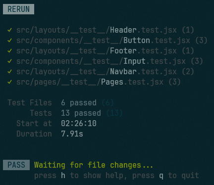

# PWL Tugas 3 2023

### Tech

[node.js](https://nodejs.org/en)
[Vite](https://vitejs.dev/)
[React.js](https://react.dev/)
[React Hot Toaster](https://react-hot-toast.com/)
[Axios](https://axios-http.com/)
[SheetDB](https://sheetdb.io/)

### How To Run?

##### 1. Clone this repository

```
git clone https://github.com/limnwhyy/120140008_tugasindividu3_pwll.git
```

##### 2. Switch to direktori

```
cd 120140008_tugasindividu3_pwll
```

##### 3. Collect depedencies

```
pnpm install
```

##### 4. Run on dev mode

```
pnpm run dev
```

##### 5. Run some test suits

```
pnpm run test
```

### Test Result


